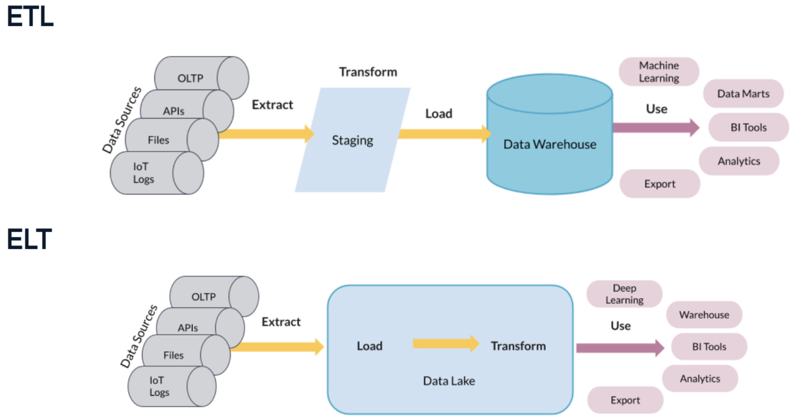
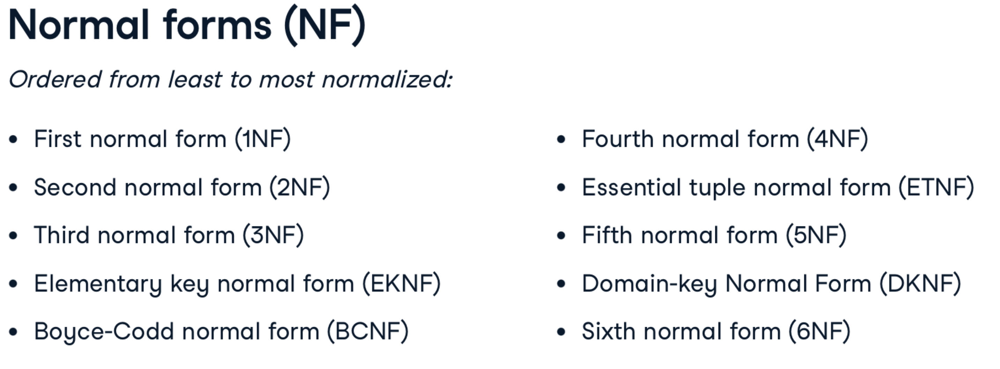

This document is divided in three sections:

    1. SQL basics (data types)
    2. SQL usage
    3. Database design


# 1. SQL basics

## Data types in SQL

Many data types exist in SQL

* String variables


* Numerical variables


* date/time data types
    * `DATE`, `TIME`, `TIMESTAMP`, `INTERVAL`
        * TIMESTAMP contains date and time and is precise to the microsecond
        * depending on needs, DATE or TIME may be better options
        * ```rental_date + INTERVAL ‘3 days’```
            * adds 3 days to the field rental_date
* arrays
    * To access array data, it is like anything:
        * ```SELECT field[1][1] FROM table```
        * Indexing start with 0
    * ```WHERE “text_to_search” = ANY(field_as_array)```
        * This will search for the text_to_search in all possible fields of the array
        * Equivalent to ```WHERE field_as_array @> ARRAY[‘text_to_search’]```


* Access the data types from the INFORMATION_SCHEMA table
    * ```SELECT column_name, data_type FROM INFORMATION_SCHEMA.COLUMNS WHERE column_name IN () AND table_name='xxx’;```


* Changing (casting) a column type into another
    * ```CAST(value AS new_type)``` equivalent to ```value::new_type```


## Basic operations on DATES

* Subtracting dates gives an integer (eg. 2 days)
* Adding an integer to a date returns a dates "inflated” by the number of days
* The difference of two `TIMESTAMP` gives an `INTERVAL`
    * This can be obtained with the `AGE(TIMESTAMP, TIMESTAMP)` function
* `timestamp “2016-05-01” + 21 * INTERVAL ‘1’ day`
    * we can multiply intervals (returns an interval), which can be added to a timestamp (returns a timestamp)
    * `NOW() + ‘1 year 2 days 3 minutes’::interval`
* `SELECT NOW()` -> timestamp with timezone
    * `SELECT NOW()::timestamp` (remove the timezone)
        * This is specific to PostgreSQL
        * `SELECT CAST(NOW() as timestamp)` is universal
* `SELECT CURRENT_TIMESTAMP(2) now()` rounded at 2 digits
    * `SELECT CURRENT_DATE` -> Date
    * `SELECT CURRENT_TIME` -> Time with timezone
* `EXTRACT(field_from_source)`
    * source can be date, timestamp, time
    * field can be year, month, quarter, day of week (aliased as dow)
    * `SELECT EXTRACT(month FROM NOW() AS month;`
        * Extracts the month field from a timestamp
    * `SELECT DATE_PART(‘quarter’, NOW()) AS quarter`
        * Returns the requested part of the timestamp. Do not mix with DATE_TRUNC.
    * `SELECT DATE_TRUNC(‘month’, NOW())`
        * Returns a timestamp with the same year and month, but everything else set at beginning value (day 1, hour 0, etc..)
* `to_char(date_created, 'day’)` converts day of weeks to Monday, Tuesday, etc.


## Basic operations on CHARACTER DATA

* Concatenate strings: `SELECT field1 || ‘sep’ || field2 AS new_string`
    * PostgreSQL as its built-in `CONCAT(field1, sep, field2)` function
    * non-string data can be concatenated with string
    * CONCAT() ignores null values, while || will return NULL
* `UPPER(field)`, `LOWER(field)`, `INITCAP(field)`
    * Different forms of string capitalization
* `REPLACE(field, “str_to_change”, “new_str”)`
* `REVERSE(field)`
    * inverses everything from the string
* `CHAR_LENGTH(field)`
    * `LENGTH()` also workds
* `POSITION(‘str' IN field)`
* `LEFT(field, n)`, `RIGHT(field,n)`
    * extracts the first n characters of field
* `SUBSTRING(field, 10, 50)`
    * extracts from char 10 with length 50
    * `SUBSTR(email FROM 0 FOR POSITION(‘@‘ IN email)`
        * FROM: beginning, FOR ending position excluded
    * `SUBSTRING(email FROM POSITION(‘@‘ IN email)+1 FOR CHAR_LENGTH(email))`
* `TRIM(leading/trailing/both(default) ‘ ‘ from string)`
    * The first two parameters are optional
        * `SELECT TRIM(“    word    “)` -> “word”
        * `LTRIM()` or `RTRIM()` or `BTRIM()` [b for both] can also be used.
    * `TRIM(street, “ 0123456789#/.”)`
        * Will clean the street names from all these characters but not the middle spaces.
* `LPAD(‘padded’, 10, ‘%’)` ; `RPAD()`
    * adds # to the word until the length is 10 %%%%padded
    * default is padding with spaces.
    * if the word is longer than the limit, it will be truncated
* `SPLIT_PART(string, delimiter, part)`


* Full-text search
    * WHERE to_tsvector(field) @@ to_tsquery(‘str_to_search’)
        * case-insensitive


# 2. SQL usage for data analyses


## Basic commands
* `SELECT * FROM table LIMIT 3`
    * Only the first 3 lines of the result
* On peut faire des opérations directement en en SQL (no FROM) `SELECT 50+2, 51*2, 17/3`
    * Careful SQL operates on integers. For fractional numbers, multiply by 1.0
* `WHERE field LIKE ‘%valier’`
    * ‘%valier’ vs; ‘_valier’ —> Percentage any number of character, underscore only one.
* `WHERE field`. This will return all the rows where the field ‘field’ is not 0.
    * `WHERE release_year <> 1960` means that we want all but those entries with release_year ‎ = 1960
    * `WHERE release_year BETWEEN 1994 AND 2000`
        * equivalent to >= 1994 and <= 2000 (inclusive of the edges)
    * `WHERE name LIKE ‘Ade%”` vs `WHERE name LIKE “Ev_”`, `name NOT LIKE “A. %“`
        * % means "anything after”, while _ means any single following character
    * `WHERE fav_fruit ILIKE “%apple%”`
        * `ILIKE` is case-insensitive!!
* `ORDER BY field DESC / ASC`
    * DESC from high to low values
* One can query field names with spaces instead of underscores using quotes, e.g. `SELECT “field name”`


## Joining tables

### Joins

* First syntax note for SQL
    * `USING (field)` if the field has the same name in the two tables;
    * `ON (table1.field = table2.field) AND (...)`


* CROSS JOIN : Produit cartésien. Crée toutes les possibilités de combinaisons entre 2 tableaux
    * `SELECT * FROM beverages CROSS JOIN food_items`

* INNER JOIN : equivalent à un cross join avec condition (WHERE ID1 = ID2)
    * `SELECT * FROM table1 INNER JOIN table2 USING (common_id)`
* LEFT JOIN : equivalent a un INNER JOIN auquel on conserve les valeurs de la table de gauche qui n’ont pas de correspondance a droite (insertion de NULL)
    * `SELECT * FROM table1 LEFT JOIN table2 USING (common_id)`
    * Le LEFT JOIN maintient la structure de la table de gauche. Toutes les lignes de gauche se retrouvent dans le resultat, mais peuvent etre dupliquees si necessaire.
* OUTER JOIN / FULL JOIN: produit un resultat equivalent a un LEFT and RIGHT JOINS combined. Les lignes de gauche sans correspondance a droite avec des NULL, et les lignes de droites sans correspondance a gauche avec des NULL.
    *` SELECT * FROM table1 FULL OUTER JOIN table2 USING (common_id)`
* SELF JOIN
    * `SELECT * FROM table1 AS name1 LEFT JOIN table1 AS name2 ON (same1.fieldX = name2.fieldY)`


* NOTES:
    * JOINs can also be done with “fuzzy” matching
        * `FROM t1 LEFT JOIN t2 ON t2.field >= t1.field1 AND t2.field < t1.field2`
    * Terms that may be useful to know
        * SEMI-JOIN : `SELECT * FROM t1 WHERE field IN (SELECT field FROM t2 WHERE)`
        * ANTI-JOIN : `SELECT * FROM t1 WHERE field NOT IN (SELECT field FROM t2 WHERE)`


### Set operations
* UNION
    * `SELECT * FROM t1 UNION SELECT * FROM t2`
        * `UNION ALL` exist and will create duplicates if need be
    * The columns in both tables must be of the same data type
* INTERSECT
    * `SELECT * FROM t1 INTERSECT SELECT * FROM t2`
    * The columns in both tables must be of the same data type
* EXCEPT
    * Record that are in the left table but not in the right table
    * `SELECT * FROM t1 EXCEPT SELECT * FROM t2`
    * The columns in both tables must be of the same data type


## Modifying fields

* `COALESCE(field, ‘new_value’)`
    * returns new_value for each null occurrence in field.
* `STRING_AGG(field, sep=', ‘)`
    * Simplifies the returned string.
* rename field `SELECT field AS new_name`
* `ROUND(field, 2)` ; `TRUNC(field, -2)`
    * negative parameters will add zeros to the result
* `SELECT generate_series(1, 10, 2)`
    * generate a series from first value to second value inclusive by steps of third value
* We can perform operations on the lines
    * `SELECT (gross - budget) FROM films`; will return the difference between th two fields for each entry
* `DISTINCT` opere sur un ensemble de lignes
* `ALTER TABLE film DROP COLUMN long_description;`


### Aggregations

#### Aggregation functions
* `SELECT COUNT(*) FROM table`—> Compte le nombre de lignes
    * `SELECT COUNT(field) FROM table` —> Compte le nombre de champ non-null dans field. Equivalent count(*) where field is not null
    * it does not remove duplicates
* Le CASE WHEN : block qui fonctionne comme un if() else().
    * ```CASE
         WHEN <clause> THEN <result>
         WHEN <clause> THEN <result>
         ...
         ELSE <result>
    END```
    * If no ELSE clause is provided, then returns NULL for all the cases that don’t match the WHEN clauses.
        * This feature can be practical to subset data.
* `SUM`, `MIN`, `MAX`, `AVG` (en fonction du langage MySQL, PostgreSQL, sqlite, AVG, AVERAGE, mEAN ...), LENGTH
* `VAR(field)` calculates the sample variance (divided by n-1).
    * it is an alias for var_samp(field)
    * The other option is `var_pop(field)` (divided by n)
* `STDDEV` the standard deviation
* `CORR(field1, field2)`
    * rows with a NULL in either column are ignored
* percentile functions:
    * `SELECT percentile_disc(percentile_desired) WITHIN GROUP (ORDER BY field)`
    * `SELECT percentile_cont(percentile_desired) WITHIN GROUP (ORDER BY field)`
        *  disc(ontinuous) vs cont(inuous). The latter interpolates between values around the specific percentile
    * **The data must be sorted!!**


#### CTE

    * CTE for ‘Common table expression’ allows creating a temporary table
        * `WITH aggregate_table as (SELECT * FROM ff GROUP BY xxx)`
    `SELECT * FROM aggregata_Table WHERE ...`
        * the 2nd, 3rd, etc CTE can refer to the previous CTEs


#### GROUP BYs and associated

* GROUP BY . It is executed after the WHERE clause
    * Le GROUP BY sur un champ peut être utilisé au lieu de DISTINCT avec pour avantage de trier les resultats alphabetiquement
    * GROUP BY 1,2 can be used to group by the first and second fields
* `HAVING` (a where applied after a group by).
    * clean the table with WHERE, then do an GROUP BY, then filter the results of the group by with HAVING
* `GROUPING SETS`: performe plusieurs GROUP BY à different niveaux, puis fait une UNION des résultats
    * `GROUP BY GROUPING SETS ((store_id, product_name), store_id, ())`
        * the empty () means all together
* `GROUP BY ROLLUP (year, region, departement) HAVING year NOT NULL`
    * strictly equivalent to GROUPING SETS ((year, region, departement), (year, region), year)
    * Par contre, ne propose pas (year, department), ou (department), ou (region), ou (region, department)
* `GROUP BY CUBE (year, region, departement)`
    * Ici, toutes les combinaisons de paramètres sont prises en compte
* `SELECT sum(field1) FILTER (WHERE field2 = ‘kn’)`
    * We do not necessarily need the group by if we only want one category.


* the `EXISTS` key word
    * `SELECT * FROM movies AS m WHERE EXISTS (SELECT * FROM renting AS r WHERE rating is NOT NULL AND r.movie_id=m.movie_id);`
        * EXISTS() returns TRUE if at least one row exists, FALSE otherwise.
        * Because we have a correlated nested query, the EXISTS() is applied to every row of movies one by one
        * Results can be inverted with `NOT EXISTS`


#### Window functions
* `OVER()` applies an aggregating function over (part of) the table
    * also called window functions
    * `SELECT SUM(field1) OVER(ORDER by field2)` —> Fait la somme cumulée de champ 1 apres avoir triee la table sur field2
    * `AVG(daily_sales) OVER(ORDER BY date ROWS BETWEEN 2 PRECEDING AND CURRENT ROW) as avg_sales_3_days`
    * `AVG(daily_sales) OVER(ORDER BY date ROWS BETWEEN 2 PRECEDING AND 3 FOLLOWING) as avg_sales_3_days`
    * `SUM(daily_sales) OVER(ORDER BY date ROWS BETWEEN UNBOUNDED PRECEDING AND CURRENT ROW) as cumulated_sum`
        * Calculates the cumulated sum.
    * `MAX(field1) OVER(PARTITION BY field2)` —> will apply the function over the field by splitted by categories defined by field2
        * PARTITION BY must come before ORDER BY and the rest
        * On ne peut pas réutiliser le résultat d’un OVER() immédiatement. Il faut passer par une CTE!
* `SELECT field1, LAG(field1, n) OVER() as field1_shifted_by_n`
    * returns the value of field1 but vertically shifted by n cells
* `ROW_NUMBER() OVER()`
    * Assigne un numero unique (par catégorie) a chaque rang
* `RANK() OVER(ORDER BY AVG(field1+field2))`
    * Prend en compte les égalités
        * e.g. 1, 2, 2, 2, 5, 6
* `DENSE_RANK() OVER()`
    * Similaire à RANK() sauf que le rang suivant une égalité est le suivant
        * e.g. 1, 2, 2, 2, 3, 4
* `QUALIFY()` allows to make a filtering n the results of an aggregation (OVER())
    * Filtrage sur les résultats du OVER() (while HAVING filtre les résultats du GROUP BY
* `LAG(var, n‎ = lag_distance;default1)`
    * `LEAD(var, n)`
    * `LEAD()` and `LAG()` are relative function since they fetch values relative to the current row.
    * `FIRST_VALUE()/LAST_VALUE(column)` are absolute function.
* `NTILE(n)` groups the data in n categories and it can be easy to get statistics, for instance, for the 1st, 2nd, 3rd and 4th quartiles.


**Note**: GROUP BY reduit la taille de ma data frame alors que le OVER maintient la dimension initiale.

## Pivoting tables
* Requires the crosstab function, which must be loaded with the following
    * `CREATE EXTENSION IF NOT EXISTS tablefunc;`
* `SELECT * FROM CROSSTAB( $$`
    `request/table to crosstab`
    `$$) AS ct (var1 VARCHAR, var2 VARCHAR ...)`
    `ORDER BY var3`


## Database view

* Def: In a database, a view is the result set of a stored query on the data, which the database users can query just as they would in a persistent database collection object
    * The view is not stored in memory, the query is
    * Data ia aggregated from data in tables and can be queried like a regular database table
* `CREATE VIEW view_name AS SELECT ... FROM ... WHERE ...;`
* `SELECT * FROM INFORMATION_SCHEMA.views;`
    * This gives you the list of views in your database
    * since there are a lot of system views, we can exclude them with `WHERE table_schema NOT in (‘pg_catalog’, ‘information_schema’)`
* Views are useful for normalized databases past 2NF (see below) because we don’t have to type complex queries all the time
* Keep in mind that views are not faster than regular queries.
    * A view is updatable if the view is made up of one table and if it doesn’t use a window or aggregate function
        * BUT we are truly modifying the table being
        * In practice, avoid modifying views
    * `DROP VIEW view_name [cascade | restrict]`
    * `CREATE OR REPLACE VIEW view_name AS (new_query)`
* there are in fact TWO TYPES of views
    * non-materialized views (what we’ve discussed so far)
    * materialized views
        * physically materialized
        * stores the query results, not the query
        * refreshed or rematerialized when prompted or scheduled
        * great with long running queries
        * particularly good for data warehouses because OLAP is not write-intensive
    * `CREATE MATERIALIZED VIEW my_view AS SELECT ...`
    * `REFRESH MATERIALIZED VIEW my_view`
        * Use Airflow and DAG (directed acyclic graphs) to update views with dependencies


* `CREATE TEMP TABLE tablename AS SELECT * FROM *`
    * This table will persist for the duration of the session only and be visible to the user only
    * `INSERT INTO new_table (SELECT * FROM *)`
    * `UPDATE new_table SET colum = new_val WHERE cond`


## Defining functions in SQL


* `CREATE FUNCTION squared(i integer) RETURNS integer AS $$`
`BEGIN`
    `RETURN i * i;`
`END;`
`$$ LANGUAGE plpgsql`


# 3. Database design

## Broad design

different approaches to processing data OLTP vs. OLAP:
* OLTP: Online Transaction Processing
    * Find the price of a book, update latest customer transaction
    * OLTP focus on supporting day-to-day operations
* OLAP: Online Analytical Processing
    * Calculate the books with best profit margin, find most loyal customers
    * OLAP tasks are vaguer and focus on business decision making


ETL (Extract Tranform Load): The most traditional
vs.
ELT (Extract Load Transform): this approach is growing with big data




## Database structure


* STAR SCHEMA: the simplest form of the dimensional model
    * Made of two tables: fact and dimension tables


* The snowflake schema is an extension of the star schema
    * it has more tables
    * The info below is the same as the info above
    * it has more dimensions because dimension tables are normalized


## Normalization
* What is normalization?
    * Formal definition by Adrienne Watt: “The goals of normalization are to: (1) be able to characterise the level of redundancy on a relational schema, and (2) prodive mechanisms for transforming schemas in order to remove redundancy”
    * database design technique
    * divides tables into smaller tables and connects them via relationships
    * goal: reduce redundancy and increase data integrity
    * Need to identify repeating groups of data and to create new tables for them


* Why do we want to normalize?
    * normalize databases have more tables, hence longer queries with more joins
    * normalization saves space! Eliminates data redundancy
    * enforces data consistency
    * afer updating, removing and inserting
    * easier to redesign by extending
    * **OLTP is write-intensive and we want to prioritize quicker and safer data insertion. OLTP = highliy normalized**
    * **OLAP prioritize quicker queries for analytics, hence denormalized.**





* A database that isn’t normalized enough is prone to three types of anomaly errors because of redundancies:
    * update, insertion, deletion
    * As tables grow, it can be hard to track redundancies and applies changes everywhere needed
    * One may want to delete one entry but due to rendundancy end up deleting several.
    * Most 3NF tables can’t have update, insertion and deletion anomalies


In the examples below, the first table example does NOT conform to the the normalization rule; the second table contains the same data and does conform to the normalization rule

### 1NF


### 2NF


### 3NF


## Database init and security


* `CREATE TABLE tablename(
    fieldname1 INTEGER PRIMARY KEY,
    fieldname2 FLOAT NOT NULL,
    fieldname3 VARCHAR(150) NOT NULL
)`
* `ALTER TABLE fact_booksales ADD CONSTRAINT sales_store
    FOREIGN KEY (store_id) REFERENCES dim_store_star (store_id);`
* `ALTER TABLE dim_author ADD COLUMN author_id SERIAL PRIMARY KEY;`
    * If the table doesn’t have a proper primary key

Table partitionning:
* Table grows too large and queries become slow

    `CREATE TABLE sales (`
     `...`
    ` timestamp DATE NOT NULL`
    `)`


    `PARTITION BY RANGE (timestamp)`

    `CREATE TABLE sales_2019_q1 PARTITION OF sales FOR VALUES FROM (‘2019-01-01’) TO (‘2019-03-31’)`
    `...`
    `CREATE TABLE sales_2019_q4 PARTITION OF sales FOR VALUES FROM (‘2019-10-01’) TO (‘2019-12-31')`
    `CREATE INDEX ON sales (‘timestamp’)`
* Different partitions can be stored on different machines to allow parallel computin; this is called sharding


### Database roles and access control
* role: an entity that contains privileges, such as can you login? can your create databses? can you write to tables?
    * `CREATE ROLE data_analyst;`
    * `CREATE ROLE intern WITH PASSWORD 'PasswordForIntern’ VALID UNTIL ‘2020-01-01'`
    * `CREATE ROLE admin WITH CREATEDB LOGIN;`
    * `ALTER ROLE admin CREATEROLE;`
* to change access to objects
    * `GRANT UPDATE ON ratings to data_analyst;`
    * `REVOKE UPDATE ON ratings to data_analyst;`
    * `ALTER ROLE marta WITH PASSWORD 's3cur3p@ssw0rd';`

* To give the same amount of roles as a predefined group role to someone
    * `GRANT data_analyst TO alex;`

* Granting and revoking access to a view
    * `GRANT/REVOKE privileges ON viewname TO/FROM role`
        * privileges: select, insertn update, delete
        * role: a database user or a group of database users
    * `GRANT UPDATE ON ratings TO public`
        * PUBLIC is equivalent o "all users"


